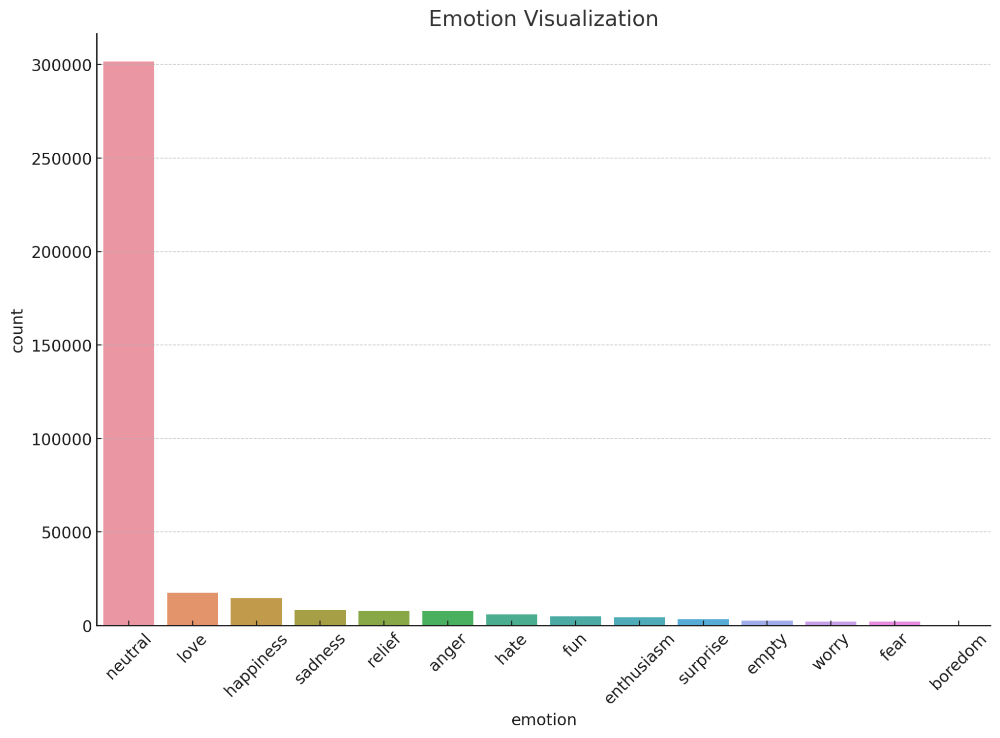

# 😊 Emotion & Sentiment Analysis

[](https://www.python.org/)
[](https://jupyter.org/)
[](https://www.tensorflow.org/)
[]()
[](LICENSE)

> 🇵🇱 [Wersja polska](README.pl.md)

> 🗓️ **Project period:** 2024

A **text-based emotion classification** project built as a Jupyter Notebook. It trains a **recurrent neural network (bidirectional LSTM)** in **TensorFlow/Keras** to recognize the emotion expressed in a short text (e.g. tweets and messages), using ~382k samples aggregated from several public Kaggle datasets. Built for a **Big Data** course.

## 📊 Datasets

The project aggregates multiple emotion-labelled text datasets from Kaggle:

| Dataset | Source (Kaggle) |
|---------|-----------------|
| Emotion analysis based on text | `simaanjali/emotion-analysis-based-on-text` |
| Text emotion recognition | `shreejitcheela/text-emotion-recognition` |
| Emotion detection from text | `pashupatigupta/emotion-detection-from-text` |
| Emotions | `nelgiriyewithana/emotions` |
| Emotion dataset | `abdallahwagih/emotion-dataset` |

The list of dataset files used by the notebook is configured in [`source/config/datasets.txt`](source/config/datasets.txt), and their sources in [`source/config/datasets_source.txt`](source/config/datasets_source.txt).

<p align="center">
  
</p>

*Combined dataset — distribution across the 14 emotion classes (heavily imbalanced toward `neutral`), a key factor handled during training.*

## 🧠 Model & results

The classifier is a **recurrent neural network (RNN)** with a **bidirectional LSTM** core, built in **TensorFlow/Keras**. It stacks an embedding layer, bidirectional LSTM, dropout and batch-normalisation, and dense layers to improve accuracy and curb overfitting.

- **Data** — ~**382,000** text samples aggregated from the Kaggle datasets above, across **14 emotion classes**, run through a full ETL pipeline (mention/URL/punctuation removal, chat-word expansion, stop-word removal, tokenisation, padding, label encoding) and split **80/20** for train/test.
- **Training** — 10 epochs; final **validation accuracy 97.69%** (overall ≈ 98%).
- **Averages** — weighted precision / recall / F1 = **0.98 / 0.98 / 0.98**; macro-average F1 = **0.89**.

<details>
<summary><b>📋 Per-class classification report</b></summary>

| Emotion | Precision | Recall | F1-score |
|---|---|---|---|
| Anger | 0.85 | 0.75 | 0.79 |
| Boredom | 1.00 | 0.99 | 0.95 |
| Empty | 0.99 | 0.99 | 0.99 |
| Enthusiasm | 0.98 | 0.99 | 0.98 |
| Fear | 0.98 | 0.92 | 0.95 |
| Fun | 0.98 | 0.98 | 0.98 |
| Happiness | 0.99 | 0.99 | 0.99 |
| Hate | 0.98 | 0.98 | 0.98 |
| Love | 0.98 | 0.99 | 0.98 |
| Neutral | 0.98 | 0.99 | 0.99 |
| Relief | 0.98 | 0.98 | 0.98 |
| Sadness | 0.99 | 0.99 | 0.99 |
| Surprise | 1.00 | 1.00 | 1.00 |
| Worry | 0.99 | 0.95 | 0.97 |

</details>

Once trained, the model predicts the emotion of a new sentence — e.g. a cheerful message → *joy*, an anxious one → *fear*. Full methodology is in the [Big Data course report](documents/).

## 📂 Repository structure

| Path | Description |
|------|-------------|
| `source/Emotion_Sentiment_Analysis_tool.ipynb` | Main notebook — data loading, preprocessing, training, and evaluation |
| `source/config/` | Dataset configuration files |
| `documents/` | Project documentation (Big Data course report) |

## 🚀 Getting started

1. Clone the repository:
   ```bash
   git clone https://github.com/Kamilr616/Emotion_sentiment_analysis.git
   cd Emotion_sentiment_analysis
   ```
2. Download the datasets listed in `source/config/datasets_source.txt` from Kaggle and place the CSV files next to the notebook (or update the paths in `datasets.txt`).
3. Launch the notebook:
   ```bash
   jupyter notebook source/Emotion_Sentiment_Analysis_tool.ipynb
   ```
4. Run the cells top-to-bottom — the notebook walks through data preparation, model training, and evaluation.

## 🧰 Tech stack

Python · TensorFlow / Keras · pandas · NumPy · NLTK · Jupyter Notebook · Kaggle API

## 📄 License

This project is licensed under the [MIT License](LICENSE).

## 👤 Author

**Kamil Rataj** — [GitHub](https://github.com/Kamilr616) · [LinkedIn](https://www.linkedin.com/in/kamil-r-153ab7121/)
