# Technical documentation

## Scope

This repository contains a Google Colab/Jupyter training workflow for assigning
one of 14 emotion labels to short English-language text. The complete experiment
is implemented in `source/Emotion_Sentiment_Analysis_tool.ipynb`; it is not a
deployed inference service.

## Data flow

```mermaid
flowchart LR
    CFG["Dataset configuration"] --> KG["Kaggle downloads"]
    KG --> MAP["Column mapping<br/>text + label"]
    MAP --> CLEAN["Regex cleaning and<br/>whitespace normalization"]
    CLEAN --> MERGE["Merge, deduplicate<br/>and shuffle"]
    MERGE --> ENC["Label encoding,<br/>tokenization and padding"]
    ENC --> SPLIT["80/20 split"]
    SPLIT --> MODEL["Embedding + BiLSTM"]
    MODEL --> REPORT["Metrics and HDF5 model"]
```

Dataset paths and Kaggle identifiers are read from:

- `source/config/datasets.txt`,
- `source/config/datasets_source.txt`.

Each source is reduced to a text column and an emotion column. Missing records
are removed, mentions, URLs and non-alphanumeric characters are stripped, and
whitespace is normalized. The frames are then merged, deduplicated by text and
shuffled.

The notebook also defines chat-abbreviation expansion and English stop-word
removal. In the recorded notebook flow, however, whitespace normalization is
called with the earlier regex-cleaned frame list, so those two intermediate
transformations do **not** feed the dataset used for training. This distinction
is preserved here because changing that branch would produce a different
experiment and invalidate direct comparison with the recorded report.

## Labels and representation

The output classes are:

`sadness`, `happiness`, `neutral`, `worry`, `surprise`, `love`, `anger`,
`relief`, `fear`, `empty`, `fun`, `hate`, `enthusiasm`, and `boredom`.

Labels are encoded with `LabelEncoder`. A Keras `Tokenizer` with a 60,000-word
limit is fitted and sequences are padded to 100 tokens. In the current notebook,
the encoder and tokenizer are fitted before the 80/20 split. This means the
vocabulary observes the evaluation texts, even though labels and model weights
are learned only from the training portion.

## Model and training

The sequential model consists of:

1. an embedding layer with 100-dimensional vectors,
2. `SpatialDropout1D(0.2)`,
3. a bidirectional LSTM with 128 units,
4. batch normalization and `Dropout(0.5)`,
5. a 14-unit softmax output layer.

It is trained for 10 epochs with batch size 64, Adam and categorical
cross-entropy. The split uses `random_state=42`. The same 20% partition is passed
as `validation_data` during training and subsequently used for evaluation; there
is no third, independent test set.

The course report records 97.69% accuracy and weighted precision/recall/F1 of
0.98/0.98/0.98 on that partition. The source report's per-class `boredom` row
contains precision 1.00, recall 0.99 and F1 0.95, which is internally
inconsistent; the README reproduces the archived report rather than silently
recalculating it.

## Running the notebook

1. Open `source/Emotion_Sentiment_Analysis_tool.ipynb` in Google Colab.
2. Provide your own Kaggle API credential when prompted. Never commit it.
3. Upload the two configuration files or adjust their paths for the runtime.
4. Run the cells in order. Dataset downloads and model training require network,
   disk space and a TensorFlow-capable runtime.

The exact dependency versions are not pinned, so later library releases can
require small compatibility adjustments and can change results.

## Artifacts and reproducibility

The notebook saves the trained Keras model in HDF5 format. It does not persist
the fitted tokenizer, label encoder or the final class-order metadata. Therefore
the HDF5 file alone is insufficient for reliable standalone inference; those
preprocessing objects must be recreated from the same data or added to a future
export format.

Further reproducibility constraints are the unpinned environment, shuffled data
without an explicit shuffle seed before splitting and external Kaggle dataset
versions. The values in the project report should be treated as archived results
of the documented run, not guaranteed output of every rerun.

## Security and data handling

- `kaggle.json` and notebook upload-cell output must remain untracked.
- Clear notebook outputs before committing to avoid leaking credentials, paths or
  downloaded data.
- Review individual dataset licences and terms before redistribution.
- The project processes public research datasets; it does not include an API,
  authentication layer or production privacy controls.
