# Dokumentacja techniczna

## Zakres

Repozytorium zawiera proces treningowy Google Colab/Jupyter, który przypisuje
krótkiemu tekstowi angielskiemu jedną z 14 etykiet emocji. Cały eksperyment jest
zapisany w `source/Emotion_Sentiment_Analysis_tool.ipynb`; nie jest to wdrożona
usługa inferencyjna.

## Przepływ danych

```mermaid
flowchart LR
    CFG["Konfiguracja zbiorów"] --> KG["Pobranie z Kaggle"]
    KG --> MAP["Mapowanie kolumn<br/>tekst + etykieta"]
    MAP --> CLEAN["Czyszczenie regex i<br/>normalizacja odstępów"]
    CLEAN --> MERGE["Scalenie, deduplikacja<br/>i tasowanie"]
    MERGE --> ENC["Kodowanie etykiet,<br/>tokenizacja i padding"]
    ENC --> SPLIT["Podział 80/20"]
    SPLIT --> MODEL["Embedding + BiLSTM"]
    MODEL --> REPORT["Metryki i model HDF5"]
```

Ścieżki i identyfikatory zbiorów Kaggle są czytane z:

- `source/config/datasets.txt`,
- `source/config/datasets_source.txt`.

Każde źródło jest sprowadzane do kolumny tekstu i kolumny emocji. Rekordy z
brakami są usuwane, podobnie jak wzmianki, adresy URL i znaki niealfanumeryczne;
następnie normalizowane są odstępy. Ramki są scalane, deduplikowane według tekstu
i tasowane.

Notatnik definiuje również rozwijanie skrótów czatowych oraz usuwanie angielskich
stop-słów. W zapisanym przebiegu normalizacja odstępów otrzymuje jednak
wcześniejszą listę ramek po czyszczeniu regex, dlatego te dwie transformacje
pośrednie **nie trafiają** do zbioru użytego do treningu. Rozróżnienie pozostaje
udokumentowane, ponieważ zmiana tej gałęzi tworzyłaby inny eksperyment i
uniemożliwiała bezpośrednie porównanie z raportem.

## Etykiety i reprezentacja

Klasy wyjściowe to:

`sadness`, `happiness`, `neutral`, `worry`, `surprise`, `love`, `anger`,
`relief`, `fear`, `empty`, `fun`, `hate`, `enthusiasm` i `boredom`.

Etykiety koduje `LabelEncoder`. Tokenizer Keras z limitem 60 000 słów zamienia
tekst na sekwencje dopełniane do 100 tokenów. W bieżącym notatniku encoder i
tokenizer są dopasowywane przed podziałem 80/20. Słownik widzi więc teksty ze
zbioru ewaluacyjnego, choć etykiety i wagi modelu są uczone wyłącznie na części
treningowej.

## Model i trening

Model sekwencyjny składa się z:

1. warstwy embeddingu o wymiarze 100,
2. `SpatialDropout1D(0.2)`,
3. dwukierunkowego LSTM ze 128 jednostkami,
4. normalizacji wsadowej i `Dropout(0.5)`,
5. warstwy softmax z 14 wyjściami.

Trening trwa 10 epok przy batchu 64 i używa optymalizatora Adam oraz
kategorycznej entropii krzyżowej. Podział ma `random_state=42`. Ta sama część 20%
służy jako `validation_data` w treningu i jest później ewaluowana; nie ma trzeciego,
niezależnego zbioru testowego.

Raport z kursu podaje 97,69% accuracy oraz ważone precision/recall/F1 równe
0,98/0,98/0,98. Wiersz `boredom` w raporcie źródłowym zawiera precision 1,00,
recall 0,99 i F1 0,95, co jest wewnętrznie niespójne. README odtwarza wynik
archiwalny zamiast po cichu go przeliczać.

## Uruchamianie notatnika

1. Otwórz `source/Emotion_Sentiment_Analysis_tool.ipynb` w Google Colab.
2. Podaj własne dane API Kaggle na żądanie. Nigdy ich nie commituj.
3. Wgraj dwa pliki konfiguracyjne lub dostosuj ich ścieżki.
4. Uruchom komórki po kolei. Pobieranie danych i trening wymagają sieci, miejsca na
   dysku i środowiska obsługującego TensorFlow.

Dokładne wersje zależności nie są przypięte, więc nowsze biblioteki mogą wymagać
drobnych zmian zgodności i dawać inne wyniki.

## Artefakty i odtwarzalność

Notatnik zapisuje model Keras w formacie HDF5. Nie zapisuje dopasowanego
tokenizera, encodera etykiet ani kolejności klas. Sam plik HDF5 nie wystarcza więc
do wiarygodnej inferencji; obiekty przetwarzania trzeba odtworzyć z tych samych
danych albo dodać do przyszłego formatu eksportu.

Odtwarzalność ograniczają też nieprzypięte środowisko, tasowanie bez jawnego
ziarna przed podziałem i zmienne wersje zewnętrznych zbiorów Kaggle. Wyniki raportu
są archiwum konkretnego uruchomienia, a nie gwarancją każdego ponownego treningu.

## Bezpieczeństwo i dane

- `kaggle.json` i wynik komórki uploadu muszą pozostać poza repozytorium.
- Przed commitem należy czyścić output notatnika, aby nie ujawnić danych logowania,
  ścieżek ani pobranych danych.
- Przed redystrybucją trzeba sprawdzić licencję każdego zbioru.
- Projekt nie zawiera API, uwierzytelnienia ani produkcyjnych mechanizmów ochrony
  prywatności.
